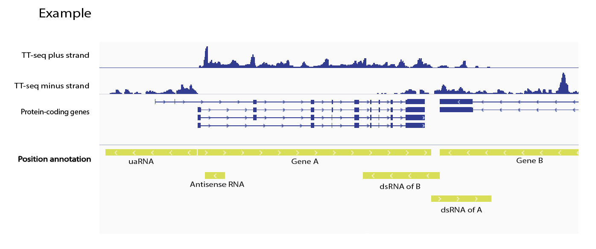
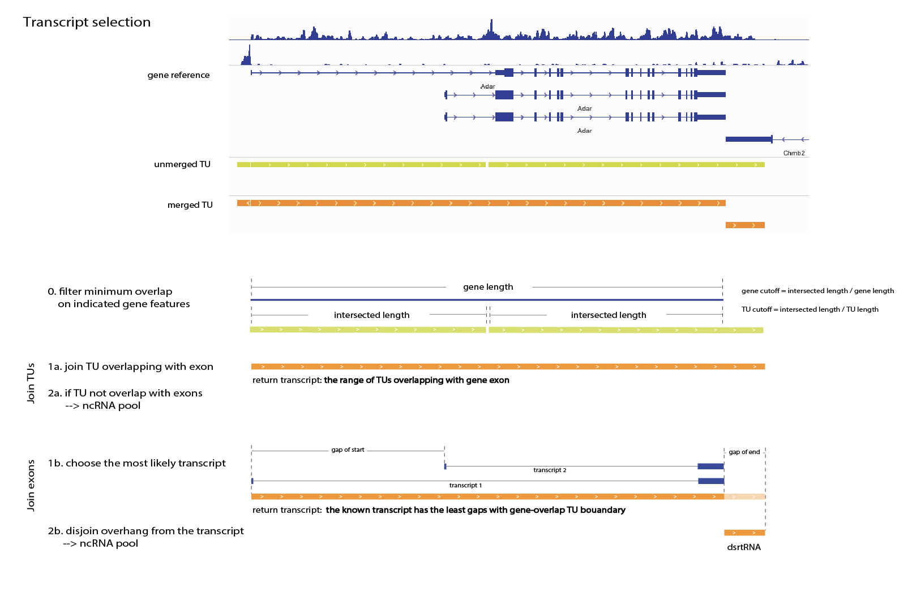

Welcome to this R shiny app!

Transcription unit (TU) annotation tool for nascent RNA-Seq analysis. 

Usage:
  - transcribed genomic regions (e.g. non-coding intergenic RNAs)
  - multiple transcriptomes comparison (e.g. GRO-seq vs PRO-seq) 
  - alternative to HOMER's [GRO-seq analysis](http://homer.ucsd.edu/homer/ngs/groseq/groseq.html), with an optional mRNA TU merging step (recommended).

Inputs:
  1. gene reference (GENCODE or ensembl)
  2. bam files (allow multiple files from replicates)
  
Output:
  - gff3 files of TU intervals (in a zipped folder)
      - with columns: expression, gene id, transript id, exon overlap, gene type, relative location to gene. 

Non-coding TUs will be named according to their relative locations to the neighbored genes.

Scattered TU intervals overlapping with gene references will be joined with a selected method:
  - by TU   (3' termination region will often be included)
  - by exon (only keeps TU intervals within gene boundary, for accurate expression level estimation, but also produces trimmed flanking TUs)

